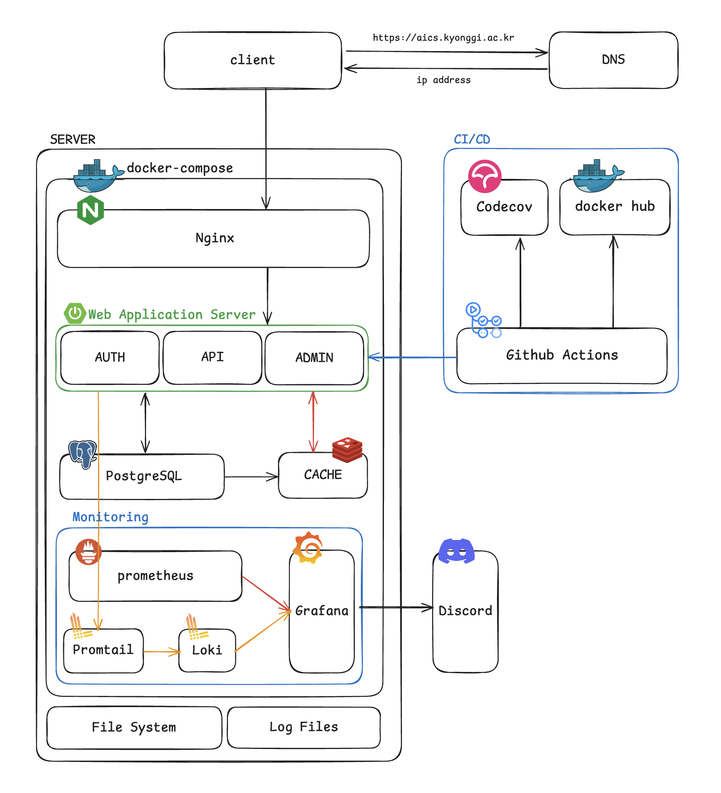
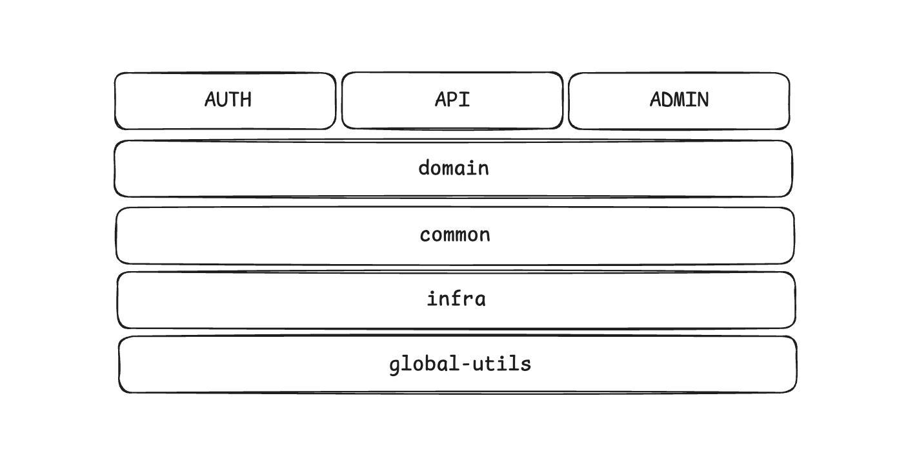

## 👋🏻 About

경기대학교 AI컴퓨터공학부 홈페이지의 서버 레포지토리 입니다.

경기대학교 AI컴퓨터공학부 학과 홈페이지 개발팀 `KGU Developers`가 주도하며, 기존 시스템의 문제들을 해결하고 더 나은 서비스를 제공하기 위해 이 프로젝트가 시작되었습니다.

<!-- 개발이 완료되면 추가
이번 리팩토링은 단순한 개선을 넘어 성능 최적화와 기능 확장성 확보에 중점을 두고 있습니다. 최신 기술을 도입하여 더 빠르고 안정적인 서비스 환경을 구축하고, 유지보수가 쉬운 구조로 설계하였습니다.

특히, 학과 운영에 필수적인 졸업 논문 관리 시스템을 전면적으로 개선하여 학생들과 교수진이 논문 제출 및 관리 업무를 더욱 효율적으로 처리할 수 있도록 하였습니다. 또한, 학과 내 협업 환경을 지원하기 위해 팀
프로젝트실 예약 시스템을 새롭게 개발하여 학생들이 쉽게 공간을 예약하고 활용할 수 있게 되었습니다. -->

이 레포지토리는 서버 API 개발을 담당하고 있으며, [프론트엔드 레포지토리](https://github.com/kgu-developers/aics-client)도 함께 공개되어 있습니다.

## 👨🏻‍💻 Contributors

|**Server**|                                                  **Server**                                                  |                                           **Server(Lead)**                                           |
|:--------------------------------------------------------------------------------------------------:|:------------------------------------------------------------------------------------------------------------:|:----------------------------------------------------------------------------------------------------:|
| [](https://github.com/minjo-on) |  [](https://github.com/LeeShinHaeng)  | [](https://github.com/LeeHanEum) |
|                               [**박민준**](https://github.com/minjo-on)                               |                                  [**이신행**](https://github.com/LeeShinHaeng)                                  |                               [**이한음**](https://github.com/LeeHanEum)                                |

## 🏗️ System Architecture


`운영 환경` : 경기대학교 AI컴퓨터공학부 홈페이지 서버 시스템은 온프레미스 환경에서 **Docker Compose** 기반으로 운영됩니다.

`모듈 분리` : **인증/인가**, **관리자**, **사용자** 모듈로 분리하여 각 애플리케이션 서버의 관심사를 분리하였습니다.

`모니터링 및 로깅` : **Prometheus**를 활용해 메트릭을 수집하고, **Promtail** + **Loki**를 통해 로그를 수집 및 저장하며, **Grafana**에서 이를 시각화하여 통합 관리합니다.

`테스트 및 배포 안정성` : **Jacoco** 라이브러리를 사용해 배포 전 테스트 커버리지를 측정하고, **Codecov**를 이용해 커버리지를 시각화하여 확인합니다. 내부 기준을 충족하지 못할 경우 자동 롤백이 진행됩니다.

`알림 시스템` : 서버 에러 발생 또는 리소스 과부하 시 **Discord**를 통해 알림이 전달 됩니다.


## 🗼 Application Architecture


경기대학교 AI컴퓨터공학부 홈페이지 서버 시스템은 **멀티 모듈 아키텍처**로 구성되어 있습니다. 
이를 통해 코드의 중복을 최소화하고, 각 모듈의 관심사를 분리하여 유지보수성을 높였습니다. 


## 🚧 Project Structure

### Multi Module Architecture

```
.
├── aics-admin          // 관리자 기능 관련 엔드포인트 및 비즈니스로직 
│   ├── src
│   │   └── ...
│   ├── buid.gradle
│   └── Dockerfile
├── aics-api            // 일반 사용자 기능 관련 엔드포인트 및 비즈니스로직 
│   ├── src
│   │   └── ...
│   ├── buid.gradle
│   └── Dockerfile
├── aics-auth           // 인증 및 인가
│   ├── src
│   │   └── ...
│   ├── buid.gradle
├── aics-common         // 공통 엔티티 및 기능 (로깅, 예외 처리 등)
│   ├── src
│   │   └── ...
│   └── buid.gradle
├── aics-domain         // 도메인 로직
│   ├── src
│   │   └── ...
│   └── buid.gradle
├── aics-global-utils   // 각종 Util 클래스
│   ├── src
│   │   └── ...
│   └── buid.gradle
├── aics-infra          // 인프라 (각종 설정 및 구성)
│   ├── src
│   │   └── ...
│   └── buid.gradle
// ..
```

###  API Module Detail Structure

```
aics-api.src.main.java.kgu.developers.api
├── foo
│   ├── application                 // 비즈니스 로직
│   │   └── FooFacade.java           // CQRS 패턴 적용을 위한 Facade 계층
│   └── presentation
│       ├── response                // 응답 객체
│       │   └── ...
│       ├── FootController.java     // Swagger 분리를 위한 추상화
│       └── FooControllerImpl.java  // 실제 API 엔드포인트 구현
// ..
```

### Domain Module Detail Structure

```
aics-domain.src.main.java.kgu.developers.domain
├── foo
│   ├── application                     // 비즈니스 로직
│   │   ├── command                     // Command 서비스
│   │   │   ├── FooCommandService.java
│   │   └── query                       // Query 서비스
│   │       └── FooQueryService.java   
│   ├── domain                          // 도메인
│   │   ├── Foo.java                    // 객체
│   │   ├── FooRepository.java          // Repository 추상화
│   │   └── Enum1.java                  // Foo 객체에서 사용하는 Enum
│   ├── exeption                        // 예외
│   │   ├── FooDomainExceptionCode.java // 통일된 예외 처리를 위한 Enum
│   │   └── FooException1.java          // 실제 예외 객체
│   └── infrastructure
│       ├── FooRepositoryImpl.java      // Repository 구현체
│       └── {ORM}FooRepository.java     // ORM을 사용한 로직 구현 (Repository 구현체에서 사용) 
// ..
```

## 📄 License
이 프로젝트는 MIT 라이선스를 따릅니다. 자세한 사항은 [LICENSE](./LICENSE) 파일을 참고하세요.